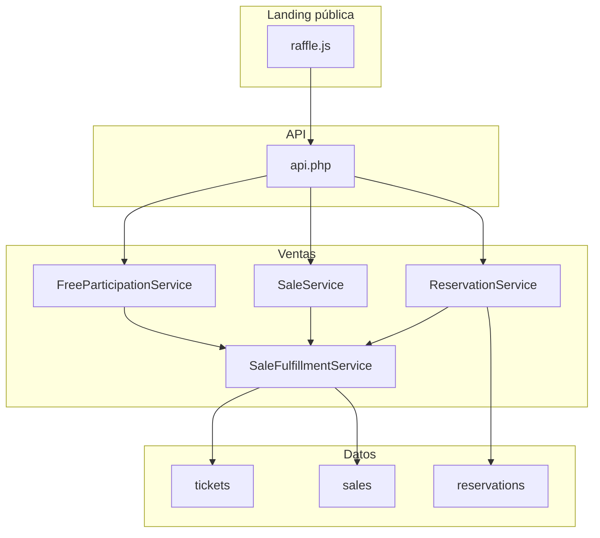

# Arquitectura

## Visión general

El sistema sigue un patrón **MVC ligero** sin framework externo. Toda la lógica de negocio vive en **Services**; los **Controllers** solo enrutan acciones y devuelven JSON o delegan a vistas PHP. Los **Models** encapsulan consultas SQL sobre tablas concretas.

```
┌─────────────────────────────────────────────────────────────┐
│  Cliente (navegador)                                        │
│  index.php · front/*.php · assets/js/*.js                   │
└──────────────────────────┬──────────────────────────────────┘
                           │ POST FormData
                           ▼
┌─────────────────────────────────────────────────────────────┐
│  front/ajax/api.php                                         │
│  module + action → Controller::handle()                     │
└──────────────────────────┬──────────────────────────────────┘
                           │
                           ▼
┌─────────────────────────────────────────────────────────────┐
│  Controllers (9)                                            │
│  Auth · Permissions · match(action) → Service               │
└──────────────────────────┬──────────────────────────────────┘
                           │
                           ▼
┌─────────────────────────────────────────────────────────────┐
│  Services (13)                                              │
│  Transacciones · reglas · orquestación                      │
└──────────────────────────┬──────────────────────────────────┘
                           │
                           ▼
┌─────────────────────────────────────────────────────────────┐
│  Models (8) + Core\Database (PDO)                             │
└──────────────────────────┬──────────────────────────────────┘
                           │
                           ▼
                      MySQL / MariaDB
```

## Capas

### `config/`

| Archivo | Función |
|---------|---------|
| `config.php` | Carga `.env-dinamicas`, define constantes, inicia sesión, protege rutas admin |
| `envLoader.php` | Parser de variables KEY=value |

### `app/Core/`

| Clase | Responsabilidad |
|-------|-----------------|
| `Auth` | Sesión, login, roles, `requireLogin()` |
| `Permissions` | Acciones restringidas a administrador |
| `Database` | Singleton PDO, insert/update, transacciones |
| `Model` | CRUD base para todos los modelos |
| `Controller` | Helper `json()` para respuestas |
| `Response` | Respuestas JSON con código HTTP |
| `SiteConfig` | Settings cacheados desde BD |
| `ThemeConfig` | Colores del recibo desde CSS |
| `RaffleMode` | Reglas rifa paga vs gratis (reutilizable) |

### `app/Support/`

| Clase | Responsabilidad |
|-------|-----------------|
| `ParticipationRules` | Validación compartida de selección de tickets |

### `app/Controllers/`

| Controller | Service principal |
|------------|-------------------|
| `RaffleController` | `RaffleService` |
| `ReservationController` | `ReservationService` |
| `SaleController` | `SaleService` |
| `CustomerController` | `CustomerService` |
| `TicketController` | `TicketService` |
| `ParticipationController` | `FreeParticipationService` |
| `DashboardController` | `DashboardService` |
| `SettingsController` | `SettingsService` |
| `UserController` | `UserService` |

### `app/Services/` — Servicios clave

| Service | Descripción |
|---------|-------------|
| `SaleFulfillmentService` | **Núcleo reutilizable**: crea venta + asigna tickets en transacción |
| `FreeParticipationService` | Participación pública en rifas gratis (1 persona = 1 número) |
| `SaleService` | Ventas desde panel admin |
| `ReservationService` | Reservas web y conversión a venta |
| `RaffleService` | CRUD rifas + generación masiva de tickets |
| `TicketService` | Inventario, info de ticket, cambio de estado |
| `CustomerService` | Clientes, normalización de teléfono CO |
| `ReceiptService` | HTML del recibo/ticket |

## Punto de entrada API

**URL:** `{BASE_URL}/front/ajax/api.php`  
**Método:** POST  
**Campos obligatorios:** `module`, `action`

El cliente JS (`assets/js/api.js`) añade `module` automáticamente en cada petición.

## Protección de rutas

### Páginas PHP públicas (sin sesión)

- `index.php`, `dash.php`, `logout.php`, `login.php`
- Cualquier script bajo `/ajax/api.php`

### Páginas admin (`front/*.php`)

Requieren sesión activa y `Auth::refreshSession()`.

### Solo administrador

- `front/settings.php`
- `front/usuarios.php`

### Permisos por acción API

Ver [funcionalidades.md](funcionalidades.md) y [api.md](api.md).

## Frontend

### Público (`index.php`)

| Asset | Rol |
|-------|-----|
| `assets/js/api.js` | Cliente HTTP unificado |
| `assets/js/raffle.js` | Grilla, checkout, rifa gratis/paga |
| `assets/css/front.css` | Estilos landing |
| `assets/css/theme-base.css` | Variables CSS del tema |

### Admin (`front/*.php` + `includes/`)

| Asset | Rol |
|-------|-----|
| `assets/js/api.js` | Cliente API |
| `assets/js/admin.js` | Cambio de contraseña propia |
| `assets/js/{modulo}.js` | Lógica por pantalla |
| `includes/head.php` | Layout, sidebar, Alertify |

## Autoload

Composer PSR-4: namespace `App\` → carpeta `app/`.

```bash
composer install
```

No hay dependencias PHP externas en `composer.json`; solo autoload.

## Extensibilidad

Para añadir una funcionalidad nueva de forma modular:

1. **Model** — consultas SQL si hace falta tabla nueva
2. **Service** — reglas de negocio
3. **Controller** — acciones y auth pública/privada
4. Registrar módulo en `front/ajax/api.php`
5. **JS** en `assets/js/` + vista en `front/`

Para flujos que crean ventas, reutilizar **`SaleFulfillmentService`** en lugar de duplicar transacciones.

Para validar selección de números, reutilizar **`ParticipationRules`** y **`RaffleMode`**.

## Diagrama de módulos de negocio


