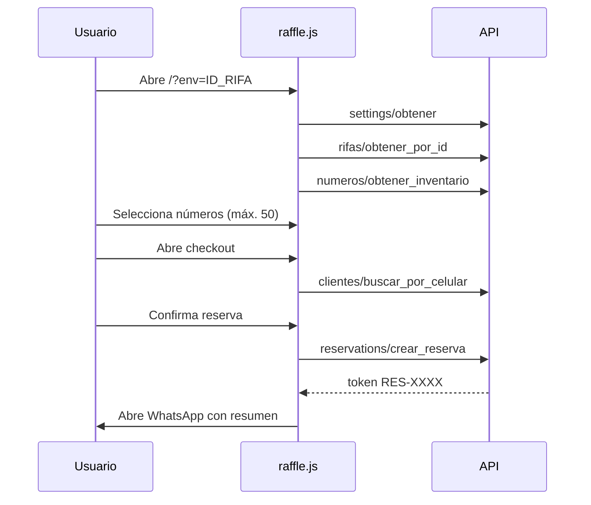
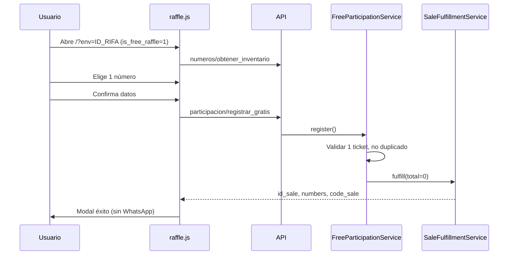
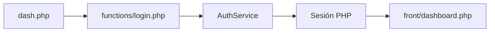

# Flujos de usuario

## 1. Landing pública — Rifa de pago



### Pasos detallados

1. Usuario entra con enlace `/?env={id_raffle}`.
2. Si `site_active = 0` → modal de mantenimiento.
3. Si rifa inactiva → banner “Rifa detenida”.
4. Carga grilla con estados: libre / vendido / reservado (con nombre abreviado).
5. Selecciona uno o más números libres.
6. Checkout: celular (10 dígitos) + nombre.
7. Al confirmar → **reserva** (tickets en estado `2`, expira en 24 h).
8. Redirección/mensaje WhatsApp con token para que el organizador confirme pago.

### Admin confirma reserva

1. Panel → **Reservas** → aceptar venta (`aceptar_venta`).
2. Se crea venta con método `Página Web` y tickets pasan a vendidos (`1`).

---

## 2. Landing pública — Rifa gratis



### Diferencias vs rifa de pago

| Aspecto | Rifa paga | Rifa gratis |
|---------|-----------|-------------|
| Máx. números | 50 | **1** |
| Endpoint | `reservations/crear_reserva` | `participacion/registrar_gratis` |
| Resultado | Reserva (estado 2) | **Venta directa** (estado 1) |
| WhatsApp | Sí | No |
| Total | price × cantidad | $0 |
| Método pago | — | `Gratis` |
| 1 por persona | No | **Sí** (por teléfono) |

---

## 3. Venta manual (panel admin)

**Pantalla:** `front/vender.php` → `vender.js`

1. Vendedor elige rifa activa.
2. Ve grilla de números (API `numeros/obtener_inventario`).
3. Selecciona cliente existente (Select2) o ingresa datos nuevos.
4. Selecciona números libres.
5. `ventas/crear_venta` → `SaleService` → `SaleFulfillmentService`.
6. Método de pago: `Manual`. Total = precio × cantidad (puede ser $0 si rifa gratis).
7. Opcional: imprimir recibo (`detalle_venta`).

---

## 4. Gestión de reservas

**Pantalla:** `front/reservations.php`

| Acción | Efecto |
|--------|--------|
| Listar | Filtros por fecha, rifa, estado |
| Aceptar venta | Reserva → venta, tickets vendidos |
| Cancelar | Tickets liberados, reserva cancelada |
| Liberar masivo (admin) | Cancela todas las reservas activas |

---

## 5. Gestión de ventas

**Pantalla:** `front/ventas.php`

| Acción | Rol | Efecto |
|--------|-----|--------|
| Ver listado / recibo | Vendedor+ | Consulta |
| Cambiar cliente | Admin | Reasigna venta |
| Liberar números | Admin | Parcial, recalcula total |
| Anular venta | Admin | Libera todos los números |

---

## 6. Administración de rifas

**Pantalla:** `front/rifas.php`

| Acción | Rol | Efecto |
|--------|-----|--------|
| Crear | Admin | Rifa + N tickets generados |
| Editar | Admin | Título, precio, gratis, estado… |
| Copiar enlace | Todos | `/?env=ID` |
| Reutilizar | Admin | Reset completo de números y ventas |
| Eliminar | Admin | Borra rifa |

**Switch “Rifa gratis”:** activa `is_free_raffle`, fuerza precio $0, cambia comportamiento de la landing.

---

## 7. Configuración del sitio

**Pantalla:** `front/settings.php` (solo admin)

- Nombre, logo, favicon
- WhatsApp principal y soporte
- Redes sociales
- **site_active** — apaga toda la landing pública

---

## 8. Inventario y números (admin)

**Pantalla:** `front/numeros.php`

- Vista grilla por rifa
- Cambiar estado libre ↔ reservado (admin)
- No permite modificar vendidos

**Pantalla:** `front/numeros-vendidos.php`

- Reporte detallado ticket a ticket con cliente y vendedor

---

## 9. Autenticación



- Login por email + contraseña
- Sesión: 8 h por defecto (`SESSION_LIFETIME`)
- Vendedor no accede a Settings ni Usuarios
- API admin sin sesión → 401 → redirect a login

---

## 10. Flujo de datos — Ticket lifecycle

```
     ┌─────────┐
     │ LIBRE 0 │
     └────┬────┘
          │
    ┌─────┴─────┐
    ▼           ▼
┌────────┐  ┌────────┐
│RESERV.2│  │VENDIDO1│  ← venta directa / admin / gratis
└───┬────┘  └────────┘
    │ aceptar_venta
    ▼
┌────────┐
│VENDIDO1│
└────────┘

Cancelar reserva / anular venta / reutilizar rifa → vuelve a LIBRE 0
```
